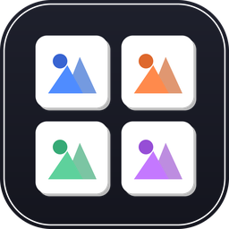

<p align="center">
  
</p>

<h1 align="center">Image Compare</h1>

<p align="center">
  A desktop application for visually comparing multiple images side by side in a customizable grid.<br>
  Built with <strong>Python</strong> · <strong>PySide6 (Qt 6)</strong> · <strong>Pillow</strong>
</p>

<p align="center">
  
  
  
  
</p>

---

## ✨ Features

| Feature | Description |
|---------|-------------|
| **Multi-image grid** | Compare any number of images in a configurable rows × columns layout |
| **Drag & drop** | Drop files onto the window or onto individual cells |
| **Clipboard paste** | `Ctrl+V` to add images directly from clipboard |
| **Cell reordering** | Drag one cell onto another to swap positions |
| **Consistent sizing** | Images are letterboxed (never stretched) with configurable padding color |
| **Zoom viewer** | Double-click any cell to inspect at full resolution with pan & zoom |
| **Grid export** | Compose the entire grid into a single PNG at 1×/2×/4× resolution |
| **Editable labels** | Optional captions under each image with customizable font size & color |
| **Layout controls** | Spacing, margins, background color, borders, drop shadows |
| **Undo / Redo** | Full undo stack for all operations (`Ctrl+Z` / `Ctrl+Shift+Z`) |
| **Dark theme** | Modern dark UI out of the box |

## ⌨️ Keyboard Shortcuts

| Shortcut | Action |
|----------|--------|
| `Ctrl+O` | Open file picker |
| `Ctrl+V` | Paste image from clipboard |
| `Ctrl+C` | Copy composed grid to clipboard |
| `Ctrl+S` | Export grid as PNG |
| `Ctrl+Z` | Undo |
| `Ctrl+Shift+Z` | Redo |
| `Delete` | Remove selected cell |

---

## 🚀 Quick Start

### Prerequisites

- Python 3.9 or later

### Run from source

```bash
git clone https://github.com/ntrThanh/Compare-Images.git
cd Compare-Images

python -m venv venv
source venv/bin/activate        # Windows: venv\Scripts\activate
pip install -r requirements.txt

python main.py
```

---

## 📦 Build Standalone App

Build a self-contained executable that runs without Python installed.

```bash
pip install pyinstaller
pyinstaller build_app.spec
```

Output:

| Platform | Location |
|----------|----------|
| Windows / Linux | `dist/ImageCompare/` (folder) |
| macOS | `dist/ImageCompare.app` |

> **Note:** PyInstaller does not support cross-compilation. Build on each target OS separately.

### Linux — Add to Application Menu

After building, run the install script to register the app in your desktop menu:

```bash
chmod +x install_linux.sh
./install_linux.sh
```

This will:
- Install the icon into `~/.local/share/icons/`
- Create a `.desktop` launcher in `~/.local/share/applications/`
- Optionally place a shortcut on your Desktop

You may need to **log out and back in** for the menu entry to appear.

---

## 🏗️ Project Structure

```
image_compare_app/
├── main.py                        # Entry point & dark theme stylesheet
├── requirements.txt
├── build_app.spec                 # PyInstaller build configuration
├── install_linux.sh               # Linux desktop integration script
├── imagecompare.desktop.template  # .desktop file template
├── assets/                        # App icons (ico, icns, png at multiple sizes)
├── core/                          # Non-UI logic (testable, reusable)
│   ├── image_data.py              #   Per-image data & lazy full-res loading
│   ├── settings.py                #   Grid layout & style options
│   ├── grid_model.py              #   Source of truth for cell contents
│   ├── commands.py                #   QUndoCommand subclasses
│   ├── image_processing.py        #   Aspect-preserving fit, padding, PIL↔Qt
│   └── exporter.py                #   Renders full grid to PIL image
└── widgets/                       # Qt UI components
    ├── image_cell.py              #   Single grid cell widget
    ├── grid_widget.py             #   QGridLayout manager + undo stack
    ├── settings_panel.py          #   Settings dock panel
    ├── zoom_dialog.py             #   Full-resolution image viewer
    └── main_window.py             #   Main window, menus, shortcuts
```

The `core/` module contains all non-UI logic and can be reused independently (e.g., for a CLI batch-export script).

---

## ⚡ Performance

- Grid previews use **downscaled thumbnails** cached per-cell — browsing 50–100 images stays smooth.
- Export always re-reads **full-resolution originals**, so output quality is never limited by screen previews.

---

## 🔧 Extending

| Goal | Where to look |
|------|---------------|
| Add a new export format | `core/exporter.py` |
| Add a per-cell action | Add a signal in `widgets/image_cell.py`, wire it in `grid_widget.py`, create a `QUndoCommand` in `core/commands.py` |
| Swap in OpenCV for image processing | `core/image_processing.py` is the only file that touches Pillow for resizing/padding |

---

## 📄 License

This project is licensed under the [MIT License](LICENSE).
